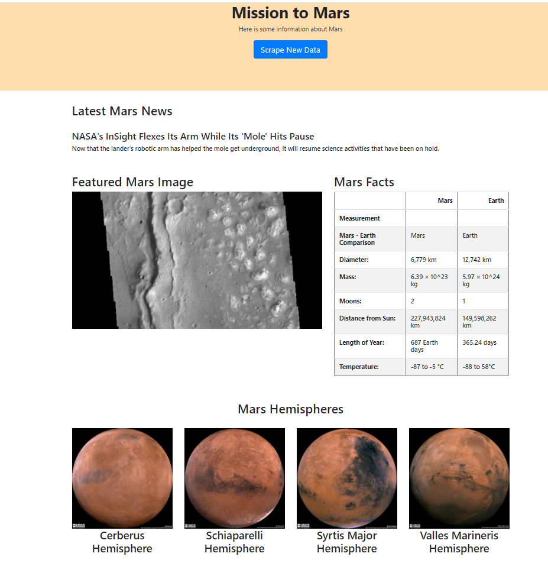

# Web Scraping Homework - Mission to Mars


In this project, I build a web application that scrapes various websites for data related to the Mission to Mars and displays the information in a single HTML page. The following outlines what I used.


## Step 1 - Scraping

I completed initial scraping using Jupyter Notebook, BeautifulSoup, Pandas, and Requests/Splinter.

* Created a Jupyter Notebook file called `mission_to_mars.ipynb` and used this to complete all of my scraping and analysis tasks. The following outlines what I did to complete this project.

### NASA Mars News

* Scraped the [Mars News Site](https://redplanetscience.com/) and collected the latest News Title and Paragraph Text. 
* Assigned the text to variables that as news_title and news_p


### JPL Mars Space Images - Featured Image

* Visited the url for the Featured Space Image site [here](https://spaceimages-mars.com).

* Used splinter to navigate the site and found the image url for the current Featured Mars Image and assigned the url string to a variable called `featured_image_url`.

* I used following code to find full image:
  ```python
  browser.links.find_by_partial_text('FULL IMAGE').click()
  ```

### Mars Facts

* Visited the Mars Facts webpage [here](https://galaxyfacts-mars.com) and used Pandas to scrape the table containing facts about the planet including Diameter, Mass, etc.

* Used Pandas to convert the data to a HTML table string.

### Mars Hemispheres

* Visited the astrogeology site [here](https://marshemispheres.com/) to obtain high resolution images for each of Mar's hemispheres.

* Created for loop to find each hemisphere images and created dictionary for hemisphere title to a list. 
  

## Step 2 - MongoDB and Flask Application

Used MongoDB with Flask templating to create a new HTML page that displays all of the information that was scraped from the URLs above.

* Started by converting your Jupyter notebook into a Python script called `scrape_mars.py` with a function called `scrape` that executed all of my scraping code from above and return one Python dictionary containing all of the scraped data.

* Next, created a route called `/scrape` that will import my `scrape_mars.py` script and call my `scrape` function.

  * Stored the return value in MongoDB as a Python dictionary named "mars_app", collection as "mars".
  * 

* Created a root route `/` that will query my Mongo database and pass the mars data into an HTML template to display the data.

* Created a template HTML file called `index.html` that will take the mars data dictionary and display all of the data in the appropriate HTML elements. 
  
######See my final web page as below. 



- - -